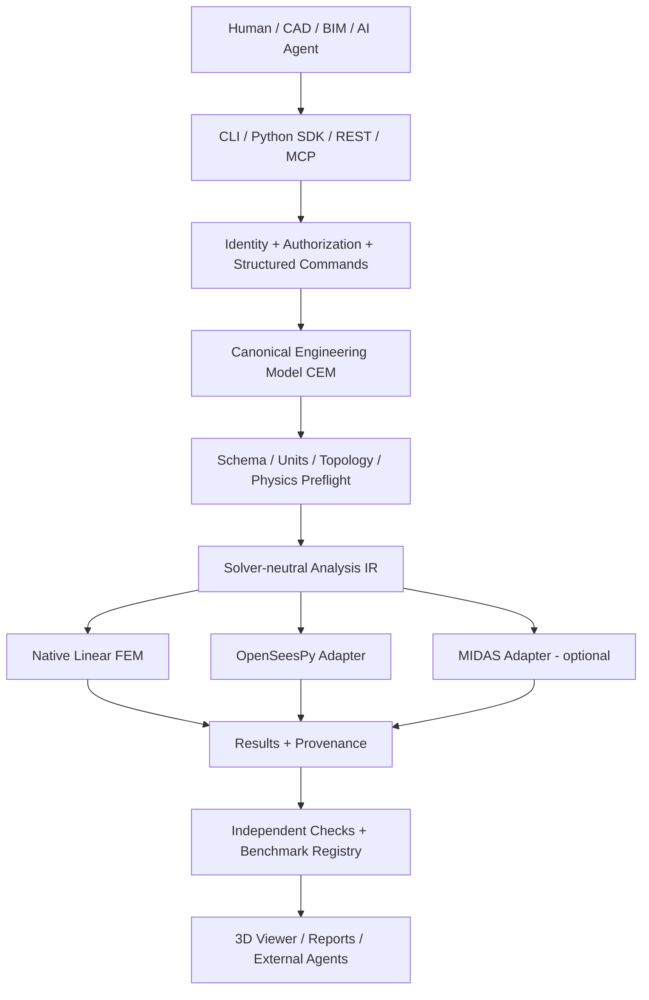

# StructNode — AI-Native Open Structural Engineering Platform

> **MASTER PLAN v1.0** · 2026-10-08 · CLI-executable project specification · Language: Traditional Chinese (engineering requirements), English (code/API).  
> **Status:** Proposed architecture; no repository has yet been selected or pushed.  
> **North Star:** Make structural analysis an interoperable, independently verifiable node in the AI engineering ecosystem, rather than a closed desktop application.

## 0. Mission, differentiation, and non-negotiables

**Mission:** 讓工程師及任意 AI Agent 能以開放的結構語意模型，完成建模 → 前處理 → 分析 → 驗證 → 視覺化 → 報告 → 跨平台交付；模型資產不被商業求解器或 GUI 綁定。

**First product:** StructNode Frame, a trustworthy linear-elastic 3D frame/truss analysis platform, not a feature-complete MIDAS clone. Its initial value proposition is *AI-native parametric modeling + solver neutrality + auditability + reproducibility*.

**Non-negotiables:**
1. LLM is an **untrusted intent translator**, never the numerical solver or authority on engineering safety.
2. Every model edit is schema-validated, unit-checked, revisioned, attributable, and reversible.
3. Every analysis records model hash, solver name/version, settings, warnings, units, load case, and result hash.
4. Separate **calculated**, **cross-checked**, **engineer-reviewed**, and **approved-for-design** states. No default claim of design fitness.
5. All public APIs are documented, versioned, machine-callable, and independent of GUI.
6. Open CEM format and export must remain available without subscription or license lock-in.
7. CI must run before a change can be considered complete. Never auto-merge engineering-critical code into protected `main`.

## 1. Architecture and role in the AI ecosystem



**Core insight:** CEM is the engineering source of truth; a solver-specific deck, CAD drawing, BIM element, mesh, or generated report is a derived representation. Model conversion must emit a **semantic loss report**, never silently discard loads, releases, coordinates, material models, or local axes.

### AI agent boundary
- AI agent can propose `CreateNode`, `CreateFrameElement`, `SetSection`, `AssignSupport`, `ApplyLoad`, `RunAnalysis` as typed commands.
- Deterministic engine checks preconditions, units, permissions, element connectivity, solver capability, and effect on model.
- High-impact operations (overwriting a model, deleting members, changing load combinations, exporting approved results) require explicit human confirmation.
- MCP exposes the same service layer as CLI and REST; never implement separate FEM logic inside MCP handlers.
- Tool results include errors, warnings, model revision, and evidence IDs; never fabricate convergence or safety certification.

## 2. Technology stack and boundaries

| Layer | Selection | Rationale |
|---|---|---|
| Language | Python 3.12+ | Engineering ecosystem and rapid iteration |
| Data contract | Pydantic v2 + JSON Schema | Strict validation and machine-readable contracts |
| Numeric kernel | NumPy + SciPy sparse | Deterministic linear algebra, sparse assembly |
| FEM reference | Independent native 2D/3D truss and 3D Euler-Bernoulli frame | Transparent baseline, explicit tests |
| External solver | OpenSeesPy, behind adapter | Independent cross-check; capability gaps documented |
| Commercial adapter | MIDAS Civil NX / Gen NX only when API licensed and verified | Optional integration; no dependency for core |
| Service | FastAPI | Typed REST/OpenAPI |
| Agent tools | MCP Python SDK | Discoverable tools for agent clients |
| CLI | Typer | Scriptable and automation-friendly |
| GUI | Three.js + React, deferred until stable solver | Web-first 3D viewer; not source of truth |
| Test | pytest, hypothesis, mypy, ruff | Numerical regression, properties, typing, lint |
| Package | uv / pyproject.toml | Reproducible Python setup |
| CI | GitHub Actions | Automated checks, security gates, build artifacts |

**Architecture boundaries:** `core` must not import `api`, `mcp`, `gui`, or proprietary adapters. No network requests from solver kernel. External solver is an optional plugin, not an implicit dependency.

## 3. Canonical Engineering Model (CEM) v0.1

CEM must contain `schema_version`, `model_id`, `revision`, `units`, `coordinate_system`, `nodes`, `materials`, `sections`, `elements`, `constraints`, `load_cases`, `loads`, `analysis_cases`, `metadata`, `provenance`.

### Required semantics
- SI internal representation; explicit conversion at boundaries. Unit-bearing user input; reject ambiguous dimensions.
- Unique stable IDs; references validated; zero-length members rejected; duplicate coincident nodes reported.
- Node position `[x,y,z]`; 6 DOF per frame node; clear truss vs frame DOF rules.
- Material `E`, `G`, `rho`, `nu` with dimensional validation and explicit applicability.
- Frame section `A`, `Iy`, `Iz`, `J` and local-axis orientation; note shear deformation excluded from first solver.
- Supports/restrains in global DOFs; end releases explicitly modeled or declared unsupported.
- Nodal loads, member distributed loads, gravity/self-weight only as supported; each load tagged with case and coordinate basis.
- Analysis case explicitly identifies linear static assumptions and solver options.
- Immutable analysis snapshots identified by SHA-256 of canonical serialized input.

**CEM v0.1 exclusions:** plates/shells, soil springs, geometric/material nonlinearity, staged construction, seismic code design, moving loads, temperature gradients, detailed RC design. Add through schema migrations and capability negotiation, not silent extension.

### Capability negotiation
Every adapter exposes `capabilities()` (element types, loads, analysis methods, supported results, units, limitations). Unsupported CEM features produce a machine-readable rejection or an **explicitly approved** degradation with loss report.

## 4. Core FEM and independent verification

### Phase 1 numerical methods
- 2D truss → 2D frame → 3D truss → 3D Euler-Bernoulli frame.
- Consistent local stiffness matrices and coordinate transformations; sparse global assembly.
- Essential boundary conditions applied by partition/elimination; reaction recovery from original full system.
- Detect singularity, unrestrained rigid-body modes, ill-conditioning, inconsistent releases; do not return plausible-looking numbers on failure.
- Separate load assembly, solve, and result recovery; verify element end forces and sign conventions.

### Required benchmark families
1. Axial bar: `u=PL/(EA)` and axial equilibrium.
2. Simply supported beam with midspan point load: `delta=PL^3/(48EI)`, reactions `P/2`.
3. Cantilever with tip load: `delta=PL^3/(3EI)`, tip rotation `PL^2/(2EI)`.
4. Symmetric truss: reactions, member forces, displacement symmetry.
5. 3D frame: local-to-global rotation invariance and member orientation.
6. Rigid-body mode test: correctly fail unstable models.
7. Mesh refinement / split-element invariance for compatible frame benchmarks.
8. Cross-solver OpenSees comparison with documented mapping and tolerances.

**Initial acceptance tolerances (review and tune per test):** exact analytical linear cases relative error ≤1e-6 for displacement/reaction where well-conditioned; global force residual normalized ≤1e-8; energy consistency within 1e-7. Near-zero values require absolute tolerances. Numerical tolerances are not engineering design safety factors.

## 5. Public tool contract (CLI, REST, MCP)

Core tools: `model.create`, `model.validate`, `model.add_nodes`, `model.add_elements`, `model.set_material`, `model.set_section`, `model.set_supports`, `model.apply_loads`, `model.diff`, `model.snapshot`, `analysis.run`, `analysis.get_results`, `analysis.compare_solvers`, `report.generate`, `adapter.import`, `adapter.export`, `capabilities.list`.

**CLI examples (target behavior, not yet implemented):**

```bash
structnode model validate examples/portal_frame.cem.json --json
structnode analyze examples/portal_frame.cem.json --solver native --output out/portal/
structnode analyze examples/portal_frame.cem.json --solver opensees --output out/opensees/
structnode compare out/portal/results.json out/opensees/results.json --json
structnode report out/portal/results.json --format markdown
structnode mcp serve --transport stdio
```

All machine-readable outputs have `schema_version`, `status`, `warnings`, `errors`, `model_hash`, `provenance`, and `artifact_paths`. Errors are typed and have stable error codes. MCP tools should be narrow and permissioned; bulk commands require dry-run and diff preview.

## 6. Interoperability roadmap

**P0:** Native CEM JSON + CSV tables, OpenSees adapter, export analysis results to JSON/CSV/Markdown.  
**P1:** MIDAS supported REST model/result endpoints after API/edition verification; JSON diff and explicit mapping loss report.  
**P2:** IFC/BIM structural mapping (geometry alone is not analytical model), DXF geometry ingestion with user mapping of layers/sections/supports.  
**P3:** USD/other 3D interchange only for visualization where appropriate; no claims of structural semantics.  
**Never:** Claim lossless DWG, IFC, MIDAS, or other proprietary round-trip without independently passing fidelity tests.

## 7. Repository layout

```text
structnode/
├── AGENTS.md
├── README.md
├── LICENSE
├── pyproject.toml
├── uv.lock
├── .gitignore
├── .github/workflows/ci.yml
├── docs/
│   ├── MASTER_PLAN.md
│   ├── ADR/
│   ├── ROADMAP.md
│   ├── VERIFICATION_MATRIX.md
│   └── MODEL_FORMAT.md
├── schemas/cem/v0.1/
├── src/structnode/
│   ├── core/model/
│   ├── core/units/
│   ├── core/validation/
│   ├── fem/elements/
│   ├── fem/assembly/
│   ├── fem/solvers/
│   ├── adapters/opensees/
│   ├── adapters/midas/
│   ├── api/
│   ├── mcp/
│   ├── cli/
│   └── reporting/
├── examples/
├── tests/unit/
├── tests/analytical/
├── tests/regression/
├── tests/integration/
└── scripts/
    ├── preflight.sh
    └── ship.sh
```

## 8. 90-day execution roadmap (15–20 hours/week)

| Sprint | Time | Deliverable | Acceptance gate |
|---|---|---|---|
| S0 | Week 1 | Repo, AGENTS.md, architecture ADR, CI, package skeleton, CEM schema | CI green, schema validates sample |
| S1 | Weeks 2–3 | Units, model editing commands, topology validator, versioned snapshots | Property/unit tests and model round-trip |
| S2 | Weeks 4–5 | 2D truss/frame solver + analytic benchmarks | Equilibrium, displacement and reaction tests |
| S3 | Weeks 6–7 | 3D truss/frame solver, sparse assembly | 3D invariance and stability tests |
| S4 | Weeks 8–9 | CLI, result schema, Markdown reports, OpenSees adapter | Cross-solver benchmarks and provenance |
| S5 | Weeks 10–11 | MCP server, REST API, permissions, model diff/dry-run | Agent tool contract tests; no unsafe direct execution |
| S6 | Weeks 12–13 | Minimal web viewer, examples, docs, alpha release | Reproducible end-to-end demo, CI release checks |

**Stretch only after core gates:** MIDAS REST adapter, DXF import, IFC mapping, auto load combinations, section library. A 90-day Alpha is an experiment, not an engineering-approved replacement.

### Exit criteria for Alpha
- 10+ deterministic benchmark models; all required tests green.
- 2D/3D linear frame and truss supported with explicit assumptions and warnings.
- Full pipeline reproducible on fresh clone without paid MIDAS.
- CLI and MCP expose equivalent validated commands.
- Every analysis output records input/solver provenance and errors.
- At least one third-party agent can create, analyze, and report a model using only published tools.
- No unsupported feature is silently approximated.

## 9. GitHub-first autonomous delivery policy (MANDATORY)

**Goal:** Every accepted coding task automatically produces a GitHub commit and a reviewable PR. Never imply a push succeeded without remote confirmation.

### 9.1 Repository bootstrap prerequisites
1. Owner provides an existing GitHub repository URL or creates a **private** empty `structnode` repository; do not guess repository or push to an unrelated repo.
2. Coding environment has Git installed and GitHub auth via `gh auth login` or scoped credential; **never** write tokens to code, logs, `.env` committed to Git, or agent output.
3. Configure remote `origin`, default branch `main`, branch protection requiring CI; agent write permissions limited to feature branches.
4. Confirm open-source license choice before publishing repository; private by default until engineering/IP review.
5. If GitHub is unavailable, keep local commit and report **NOT PUSHED**; retry only after explicit authorization/access.

### 9.2 Autonomous loop per task

```text
READ PLAN + AGENTS.md + current git status
  -> CREATE ISSUE / TASK ID (when API available)
  -> BRANCH feat/<issue>-<slug> from updated main
  -> IMPLEMENT smallest vertical slice
  -> RUN formatting + static checks + tests + benchmark suite
  -> WRITE benchmark evidence / change log
  -> COMMIT with descriptive message
  -> PUSH feature branch to origin
  -> OPEN PR with acceptance checklist + test evidence
  -> WAIT for CI; fix until green
  -> STOP for human review on safety-sensitive changes
```

**Rules:** No direct push to `main` by an agent. No force-push to shared branches. Never commit secrets, customer engineering drawings, licensed MIDAS files, or unapproved proprietary code. If tests fail, commit to feature branch only with clearly marked WIP if needed; never mark task complete or request merge. No autonomous production release or engineering sign-off.

### 9.3 Local scripts: required implementation

Create `scripts/preflight.sh`:

```bash
#!/usr/bin/env bash
set -euo pipefail
uv sync --all-extras --dev
uv run ruff check .
uv run ruff format --check .
uv run mypy src
uv run pytest -q
```

Create `scripts/ship.sh`:

```bash
#!/usr/bin/env bash
set -euo pipefail
: "${1:?Usage: scripts/ship.sh <commit-message>}"
branch="$(git branch --show-current)"
if [[ "$branch" == "main" || "$branch" == "master" || -z "$branch" ]]; then
  echo 'ERROR: shipping from protected/default branch is forbidden' >&2; exit 1
fi
if ! git remote get-url origin >/dev/null 2>&1; then
  echo 'ERROR: origin not configured; NOT PUSHED' >&2; exit 1
fi
bash scripts/preflight.sh
git add -A
if git diff --cached --quiet; then echo 'No staged changes'; exit 0; fi
# Add secret scan and prohibited-data checks before commit in implementation.
git commit -m "$1"
git push --set-upstream origin "$branch"
# `gh` CLI must be authenticated; failures must be reported, not swallowed.
if ! gh pr view --json url >/dev/null 2>&1; then
  gh pr create --fill --base main
fi
printf 'PUSHED branch=%s commit=%s\n' "$branch" "$(git rev-parse HEAD)"
```

**Important:** `git add -A` is permitted only after a staged-file review, secret scan, `.gitignore` check, and explicit policy enforcement. Implement these safeguards in S0 before enabling `ship.sh` for unattended execution. The snippet is a template, not a production-ready security guarantee.

### 9.4 Required CI (`.github/workflows/ci.yml`)

```yaml
name: CI
on:
  pull_request:
  push:
    branches: [main]
jobs:
  validate:
    runs-on: ubuntu-latest
    permissions:
      contents: read
    steps:
      - uses: actions/checkout@v4
      - uses: astral-sh/setup-uv@v6
        with:
          python-version: '3.12'
      - run: bash scripts/preflight.sh
```

Pin GitHub Actions by verified commit SHA before production use, enable Dependabot and secret scanning, and add a dedicated numerical benchmark job with stored baseline artifacts.

### 9.5 PR definition of done
- [ ] New/changed API contracts documented and schema version considered.
- [ ] Analytical tests and regression fixtures included for solver changes.
- [ ] CI green; warnings explained; benchmark deltas reviewed.
- [ ] Reproducibility metadata recorded.
- [ ] No secrets, client drawings, copyrighted MIDAS binaries, or unsafe model files.
- [ ] GitHub feature branch pushed; PR URL and commit SHA returned.
- [ ] Human review required for core solver, units, load combinations, structural design checks, release tagging.

## 10. Engineering assurance and security

**Numerical:** tests at unit/element/global matrix/solver/integration levels; energy balance, reactions, rigid-body mode detection, solver comparison, deterministic seeds and tolerances. Maintain a `VERIFICATION_MATRIX.md` linking requirement → benchmark → result → reviewer.

**Agent security:** untrusted text cannot issue arbitrary shell commands; tools accept typed data, not executable Python. Sandbox uploaded files, enforce resource quotas, protect filesystem paths, disallow uncontrolled remote solver requests, redact PII and project details from telemetry. No implicit auto-approval of engineer-significant changes.

**Professional boundary:** All Alpha reports must show `EXPERIMENTAL — NOT FOR ENGINEERING DESIGN WITHOUT INDEPENDENT REVIEW`. Final design decisions remain with a qualified engineer; keep calculation and review trails.

**Licensing/IP:** check dependencies and plugin licenses, external API terms, and whether bundled example models are redistributable. Choose project license explicitly (e.g., Apache-2.0 vs GPL) after business/IP review; do not copy proprietary solver internals.

## 11. Product strategy: the potential 'Blender moment'

**Wedge:** Parametric 3D frames and trusses for small engineering practices, educators, automation-heavy teams.  
**Moat:** Open CEM + verification benchmarks + plugins + model provenance + agent-compatible tools + repeatable reports.  
**Not a moat:** generated GUI, code volume, a claim of 'same as MIDAS', GitHub stars alone.

**Adoption metrics:**
- Time from engineering brief to verified frame model vs current MIDAS workflow.
- Fraction of third-party models imported with no material semantic loss.
- Cross-solver numerical agreement on benchmark set.
- Percentage of workflow completed via documented API without GUI.
- External integrations and repeat users; bug severity and time-to-fix.

**Decision gates:**
- Day 30: Can a new engineer reproduce a benchmark on fresh clone?
- Day 60: Is 3D frame solution demonstrably correct and stable?
- Day 90: Can a third-party agent create/solve/report a frame without privileged access?
- Month 6: Are engineers voluntarily using it for bounded non-critical workflows?
- Month 12: Is there external plugin/model ecosystem traction?

## 12. First task for a coding CLI — EXECUTE IN ORDER

```text
You are the lead implementation agent for StructNode.
Read docs/MASTER_PLAN.md and AGENTS.md before writing code.
Work in small vertical slices; never invent engineering capabilities.

TASK S0:
1. Inspect repository, git remotes, branch protections, auth availability, and existing files.
2. If repo is absent, ask for the exact GitHub owner/repository; DO NOT push elsewhere.
3. Establish Python package, uv config, Pydantic CEM v0.1, model JSON fixture.
4. Implement strict schema/unit/topology validation and CLI `model validate`.
5. Write pytest cases for valid model, missing node, duplicate ID, zero length,
   missing units, invalid modulus, and unsupported features.
6. Add ruff, mypy, pytest, CI, README, AGENTS.md, LICENSE decision placeholder.
7. Add preflight/ship scripts, safe secret scanning and staged file review.
8. Run full preflight; show failures and fix them.
9. Commit on `feat/s0-foundation`, push to the configured GitHub origin,
   create PR, and report PR URL, commit SHA, test counts, unresolved risks.
10. If remote/auth unavailable, stop after local work and report NOT PUSHED.

Do not implement nonlinear FEM, claim engineering approval, or silently change scope.
Do not auto-merge to main.
```

## 13. Next instructions for owner

1. Confirm the exact GitHub repository `owner/structnode` (existing or newly created) and whether it is private; private is recommended at start.
2. Decide license before public release; project may initially remain private without a license.
3. Run coding CLI with this document in `docs/MASTER_PLAN.md` and execute Section 12.
4. Enable protected `main` and required CI before autonomous pushes.

**State as of this plan:** A Markdown plan has been authored. No GitHub repository selection, code deployment, or push is implied.
